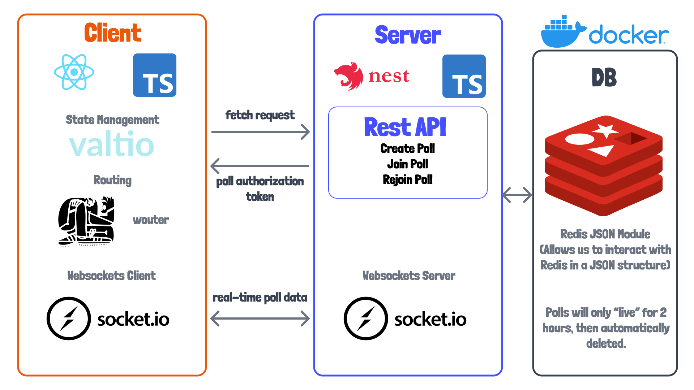

# 01 - Application Overview

In this tutorial we're going to build a fun little demo product that I have worked on over the last several months. In thinking about ideas for this project, I wanted to build an app with some sort of real-time feature, meaning that data is immediately "synced" from the server to all of the connected front-end client applications. 

A little over a year ago, I remember much ado made about the New York City's mayoral election being a ranked choice vote. Combining the desire to make a "real-time" application demo and to solve the problem of making decisions more quickly among friends, I decided to make this app called **Ranker**, which I will now present.

*Show demo of the project with 4 browser windows. Demonstrate how to create a "poll", and then join a poll. Show the nomination of candidates and the voting pages of the application. Finally, show the results page.*

## Not for beginners

Now that I've showed you the app, I'll need to come clean about something.

This *IS NOT* a beginner-friendly tutorial or project. I expect you to know how create a basic front-end application in react, or even in another front-end framework like Vue, Angular, Svelte, SolidJS, etc. I will not explain React. I will not explain NodeJS or how to install packages. I also expect you'll be able to install Docker on your computer and run a container, though I will provide you the configuration to do this. 

A knowledge or familiarity with Typescript will also be helpful. We'll be writing our browser application in using React with Typescript. I'm not a Typescript expert myself, so I hope you'll be able to follow along even with an elementary understanding of Typescript - though you may need to use a little of Señor Google here or there.

## "Architecture" Overview

The figure below gives an overview of the tools, languages, or frameworks we'll be using to build this application.

## Getting Started

To get started, let's first take a look at this repository's [readme](../readme.md). 

*Go through recommend readme steps to `degit` the repository*

### Project Root

At the project root we have a few important files. First, we have a [package.json](../package.json). This is a pretty bare-bones file with scripts to run all of our applications with npm scripts, or commands. We also declare "workspaces" for our client and server applications. We'll get to these applications shortly. We can start these separately from the root of the project, or we can run them all use `npm run start`. 

But before we continue, let's run `npm install` from the root folder! This will install dependencies inside of our workspaces as well. 

This command will boot up an instance of a `redis-json` docker container with `docker-compose`, which will be the main database for our application. The configuration of our container is found in [docker-compose.yml](../docker-compose.yml).

The `wait-on` command in the `"server:dev"` script allows us to wait for our Redis container to run and expose its port. Once the Redis port is available we can start up the server application. We then use the `concurrently` command to start up both our client and server applications.

We also have a `storybook` command which will allow us to play with some of the UI components I created ahead of time for this tutorial. We'll look at this shortly. 

### Client Application

The client application is located inside of the [client](../client/) folder. This is a bare-bones react application, except that I've already added the dependencies we'll use throughout the application. 

We'll be using vite for our front-end development tooling. We have install ViteJS as a dependency and we have a basic [vite config file](../client/vite.config.ts). 

We also have files for [ESLINT](../client/.eslintrc) configuration to work with React, Typescript, and the prettier formatter. The corresponding [Typescript config](../client/tsconfig.json) and [Prettier config](../client/.prettierrc) files are also included. 

We'll be using TailwindCSS for our styles. I chose this because it's widely used. We won't be doing anything too fancy with it, so I think you'll be able to follow along with a basic understanding of CSS, or another CSS framework.

Our `src` folder has some basic files with utility and data fetching functions which we'll cover later. It also has a global style sheet, [index.css](../client/src/index.css). 

One part of the application that I "pre-created" were some basic UI components, which can be found in the `src/components` folder. I also added Storybook to the application so you can get a feel for these components. I won't cover much about Storybook in this tutorial, but let's run `npm run storybook` to see what it does. You can run this command from either the `client` folder or from the project root.

*run storybook, and show some components*

### Server Application

Let's now turn to the `server` folder and application. This application is setup to run [NestJS](https://nestjs.com/), which is a framework for building NodeJS server applications. I kind of think of it as the ASP.NET core of Node, of the Angular JS of backend as it uses similar patterns for structuring application features and dependency injection. Then again, I have only scratched the surface of Angular and C# backend business, so this may not be a fair comparison. 

This project also uses similar configuration (ESLINT, PRETTIER, TYPESCRIPT) like the client. So the tooling isn't all that terribly different!

As of right now, this application has a simple `main.js` file which loads some environment configuration from a [.env file](../server/.env), and starts up a server on port `8080`.

Before continuing, I'd like to note that we will later create a `shared` workspace for common data types shared between the `server` and `client` application. 

### Run the Application

Let's now run our development environment with `npm run start` from the root directory... just to make sure everything is working fine and dandy. 

## Conclusion

I'm sure I've forgotten something, but that's OK. I'm sure we'll cover whatever I missed at some point.

Next time I think we'll work on creating some REST API endpoints which will eventually be used for creating "polls". We'll probably go about creating the server as much as possible before moving onto the client. So if you hate backend development... well, sorry... come back in a couple of months...🤷🏻?

Anyhow... I hope you are as excited to get to work on this project as I am! See you in the next one!

