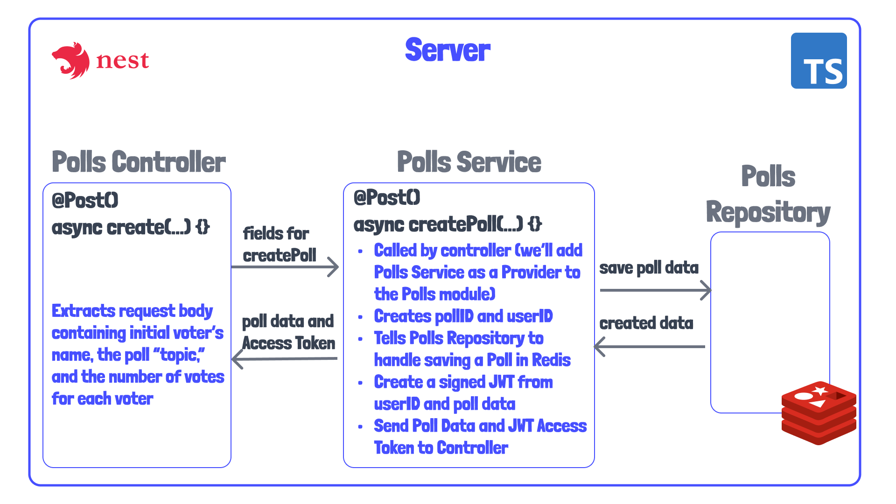

# 04 - Creating a Redis Module

Thanks for coming back! Today we're going to go over something a bit more interesting, I hope. And what is that? It's how to create our own dynamically configured module, which will give us access to a Redis client within our application. 

In the last tutorial we learned about creating a service for managing the application logic for creating and joining a poll. We also went over how to inject this service as a provider into the polls module, so that our controller could call methods in this service.

See .

Soon we'll start working on the polls repository which will contain methods for storing data about a poll inside of Redis. But first, we need to be able to access Redis. That's exactly what we'll be working on today!

## Review of Modules

[Modules Reference](https://docs.nestjs.com/modules)

Recall that a module is NestJS's recommended way to organize and application's features. If we look at our [polls module](../server/src/polls/polls.module.ts), we see that we have a few properties in the `@Module` decorator. The `imports` array allows us to import other modules' features into our module. In this example, we import the `ConfigModule`, which is a module provided by NestJS for accessing things configuration files and environment variables. Then we also have `providers` and `controllers` that we worked on in the last tutorial. 

There is another field, however, that is not included in this module, which is called `exports`. This is a very important field when creating a module that will be "consumed" by other modules, as this determines what those other modules will have access to.

What we want to do, is find a way to create a module that exports some feature based on configuration. In our case, this will be configuration for how to connect to Redis. If we look at our [app.module.ts](../server//src/app.module.ts), we see that we have a sort of factory on `ConfigModule` to instantiate the module, called `forRoot`. This is how the module is instantiated and loads up environment variables.

In the case of Redis, we want to make sure that we connect to Redis before making our Redis client available to the modules that use it. This is a little different from the synchronous `forRoot` method. We'll also want access the previously instantiated `ConfigService`.

A nice example of how we can do this is the [NestJS JWT Module](https://github.com/nestjs/jwt#async-options). We're going to duplicate the pattern in case 1, with a `useFactory`.  We'll accept an existing `ConfigModule` in our `imports` array, and we'll `inject` the result `ConfigService` which is made available. The `useFactory` will be an asynchronous callback that will handle loading environment variables for our Redis configuration. We might not actually have async code in this `useFactory`, but in general, there "could be" asynchronous code in it.

Now let's move on to creating our module with a similar configuration, to see what we actually do with these parameters. Brace yourself, this gets a little complex! But if it's not complex, we don't make any money. 

## Outlining RedisModule

Let's create [redis.module.ts](../server/src/redis.module.ts) at the root of our server source folder. Inside, let's scaffold out the structure of this module.

```js
import { DynamicModule } from '@nestjs/common';
import { Module } from '@nestjs/common';
import IORedis from 'ioredis';

@Module({})
export class RedisModule {
  static async registerAsync(): Promise<DynamicModule> {
    return {
      module: RedisModule,
      imports: [],
      providers: [],
      exports: [],
    };
  }
}
```

We define the module with the @Module decorate, and define a `registerAsync` method which will return a `DynamicModule`. A `DynamicModule` is basically an object that has the fields required of a module. We'll also start adding our imports, including `IORedis`, which is the library we'll be using to create the Redis client. 

Now I want to define some configuration options for this module, which sort of matches what we saw with the JWT module. This is going to be a little tricky, so I'd encourage you to go back and stare at the JWT configuration if you need to!

```js
import { DynamicModule, FactoryProvider, ModuleMetadata } from '@nestjs/common';
import { Module } from '@nestjs/common';
import IORedis, { Redis, RedisOptions } from 'ioredis';

type RedisModuleOptions = {
  connectionOptions: RedisOptions;
  onClientReady?: (client: Redis) => void;
};

type RedisAsyncModuleOptions = {
  useFactory: (
    ...args: any[]
  ) => Promise<RedisModuleOptions> | RedisModuleOptions;
} & Pick<ModuleMetadata, 'imports'> &
  Pick<FactoryProvider, 'inject'>;

@Module({})
export class RedisModule {
  static async registerAsync({
    useFactory,
    imports,
    inject,
  }: RedisAsyncModuleOptions): Promise<DynamicModule> {
```

The first type we create is `RedisModuleOptions`. This will contain options of instantiating a RedisClient. This type definition is provided by `IORedis`. The second option is a function that we can optionally call when the client is ready. I make this optional with a question mark, `?`. This is a function we can use for logging that Redis is ready, or perhaps there is some other Redis dependent logic we'll need.

The `RedisAsyncModuleOptions` type defines the parameters we'll pass the `registerAsync`. Note that I destructure this in the function.

This type defines the `useFactory` method (take a look again at the JWT module). We don't really care about the arguments passed to this function from where it is called. All we care about it that it returns our `RedisConnectionOptions` and maybe an `onClientReady` callback.

I then used some a "fancy" Typescript types called `Pick`. I had to dig around to find these types. But the correct type definition for `imports` that you see in modules is on the `ModuleMetaData` type. I only want our `registerAsync` to use this. Then I found that the `inject` field type can be found in the `FactoryProvider`. I import these types from NestJS. *I'd command click to see these definitions.*

## Defining registerAsync

Now lets actually do something with the accepted parameters.

First, we'll take the `imports`, and forward it on to the DynamicModule that we're returning. 

```js
return {
      module: RedisModule,
      imports: imports,
      providers: [],
      exports: [],
    };
```

Next, we will define our dynamically created module to return in the `providers` array.

```js
export const IORedisKey = 'IORedis';

// omitted content

    const redisProvider = {
      provide: IORedisKey,
      useFactory: async (...args) => {
        const { connectionOptions, onClientReady } = await useFactory(...args);

        const client = await new IORedis(connectionOptions);

        onClientReady(client);

        return client;
      },
      inject,
    };

    return {
      module: RedisModule,
      imports,
      providers: [redisProvider],
      exports: [redisProvider],
    };
```

Our `redisProvider` will take the shape of a dynamically created provider. We can give the `provide` field a key which can be used to locate the module wherever we want to inject it. You'll see this later on when we create a `repository` layer for creating and retrieving data from Redis. 

In the `inject` field, we forward whatever was provided in the parameter, which in our case will end up being the `ConfigService`. This will give the module access to the `ConfigService`. This is because we'll also need to access some environment variables inside of our `PollsRepository` which we'll create later.

The `useFactory` method (the one in the returned object) is a specific field for providers that indicates to NestJS that we need to resolve any asynchronous data before our module is ready. 

In it, we call the "other" `useFactory` method we're passing in, which can contain any arguments, but is forced to return the IORedis `RedisOptions` and maybe an `onClientReady`.

We then create our `IORedis` client, execute the `callback` (which we'll se shortly), and return the `client`.

Let's now actually create our module, which will hopefully drive home what this code it doing, as I find this code a little abstract.

## Creating the Module

We'll now create a dynamic configuration of this module. To do so I'm going to create a file called [modules.config.ts](../server/src/modules.config.ts). I only to this because there's quite a bit of code to configure this module, which I'd rather not include in our [polls.module.ts](../server/src/polls/polls.module.ts).

First I'll import the node modules we'll need for setting up or RedisModule.

```js
import { Logger } from '@nestjs/common';
import { ConfigModule, ConfigService } from '@nestjs/config';
import { RedisModule } from './redis.module';
```

We'll create our first custom `Logger` which will be helpful for logging that we've connected to Redis. 

Remember that we'll use the `registerAsync` to load our module.

```js
export const redisModule = RedisModule.registerAsync({
  imports: [ConfigModule],
  useFactory: async (configService: ConfigService) => {
    const logger = new Logger('RedisModule');

    return {
      connectionOptions: {
        host: configService.get('REDIS_HOST'),
        port: configService.get('REDIS_PORT'),
      },
      onClientReady: (client) => {
        logger.log('Redis client ready');

        client.on('error', (err) => {
          logger.error('Redis Client Error: ', err);
        });

        client.on('connect', () => {
          logger.log(
            `Connected to redis on ${client.options.host}:${client.options.port}`,
          );
        });
      },
    };
  },
  inject: [ConfigService],
});
```

First, we make sure to import the `ConfigModule`, and then we inject it, which basically forwards this ConfigService on to the `RedisModule`.

In `useFactory`, which actually gets called in our `registerAsync`, we return connection options based on some environment variables, which we have already defined in [.env](../server/.env). In register `async` this config will be used to create the client, which we'll have access to in the `onClientReady` callback.

We use this client for some logging. First, we'll log if there are any errors. Notice at the top of the logger we've defined a logger with the string "RedisModule." We'll clearly be able to see this logs when we start our application!


## Register Module in Polls Module and Test

Alright, the moment of truth is upon us!

Let's provide our "lowercase" `redisModule` which we just created into our [PollsModule](../server/src/polls/polls.module.ts).

```js
import { redisModule } from 'src/modules.config';

// content omitted

@Module({
  imports: [ConfigModule, redisModule],
  controllers: [PollsController],
  providers: [PollsService],
})
export class PollsModule {}
```

To start the app, go to the root folder. Make sure you have docker booted up on your machine, and run `npm run start`.

Remember that we have redis set up to run in Docker in our [docker-compose.yml](../docker-compose.yml) file at the project root. 

If you look in the logs, we'll a few lines of logging we created for `Redis`.

```sh
LOG [RedisModule] Redis client ready
LOG [RedisModule] Connected to redis on localhost:6379
```

## Next Time

With an ability to store data in Redis, we'll work on creating a `PollsRepository` next time. This will allow us to accept data from an incoming `createGame` request, and... well... create a game from it. 