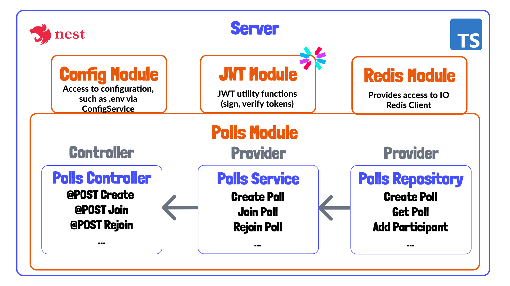

# 06 - Configuring the JWT Module

In the last tutorial we got to the point where we can store data about our poll inside of Redis. It took quite a bit of work to get to that point.

Today, we're going to working on configuring a [module provided by NestJS](https://github.com/nestjs/jwt) for producing, or signing, as well as verifying JSON Web Tokens.

## Purpose of JWT Module

Looking at the diagram below, we'll be configuring the JWT module. This will be injected as a provider to our [Polls Module](../server/src/polls/polls.module.ts). This will give us access to functionality of the [node-jsonwebtoken](https://github.com/auth0/node-jsonwebtoken) in classes within the `PollsModule`.

The main place that we'll use these JWTs today is within the [Polls Service](../server/src/polls/polls.service.ts). When a user creates a poll, or joins a poll, we'll return a JWT will information about the poll they have joined along with their user information. This will allow them to update the specific poll they have joined, and only that poll.

Later on, we'll end up created "authorization guards" that check a client, or user's token, and identify which poll they are updating. 



## Configuring JWT Module

To configure the JWT module, let's reuse our [modules.config.ts](../server/src/modules.config.ts) which we used to configure the [Redis Module](../server/src/redis.module.ts). This time, however, we won't have the pleasure of actually creating our own module, which I know is a real bummer.

First, we'll add our import of the module and add its `registerAsync` method. Recall that we created a similar sort of method for instantiating the Redis Module, and that's because I sort of mimicked the JWT module!

```ts
import { JwtModule } from '@nestjs/jwt';

// ... omitted content

export const jwtModule = JwtModule.registerAsync({});
```

This module, just like or RedisModule, will need access to the `ConfigModule` and `ConfigService`.

```ts
export const jwtModule = JwtModule.registerAsync({
  imports: [ConfigModule],
  inject: [ConfigService],
});
```

Next, we're add a `useFactory` function to our config which will return our JWT options based on config, or in our case, environment variables.

```ts
export const jwtModule = JwtModule.registerAsync({
  imports: [ConfigModule],
  useFactory: async (configService: ConfigService) => ({
    secret: configService.get<string>('JWT_SECRET'),
    signOptions: {
      expiresIn: parseInt(configService.get<string>('POLL_DURATION')),
    },
  }),
  inject: [ConfigService],
});
```

As you can see, we'll get our JWT secret from the [.env](../server/.env) file. This secret is used to "sign" the token. The basically creates a signature portion of the JWT which is only produced by the exact payload our token is signed with. So basically, the combination of our actual token content plus the secret will produce a particular signature. 

This isn't a course on JSON Web tokens, but we'll see this "signature" in the [jwt.io debugger](https://jwt.io/#debugger-io) later on!

We can also set an expiration time on the token. In our case, we'll make it the same as the `POLL_DURATION`. In reality, this means our tokens we'll slightly outlive our poll, but this is a case I'm willing to live with.

Let's now import and register this configured provider in [polls.module.ts](../server/src/polls/polls.module.ts).

```ts
import { jwtModule, redisModule } from 'src/modules.config';

//... omitted content
@Module({
  imports: [ConfigModule, redisModule, jwtModule],
  controllers: [PollsController],
  providers: [PollsService, PollsRepository],
})
export class PollsModule {}
```

## Sign JWTs in Polls Service

With the JWT Module configured, we'll be able to use a `JWTService` inside of our Polls Module, and in this tutorial, we'll be using it more specifically inside of [polls.service.ts](../server/src/polls/polls.service.ts).

We'll first add the `jwtService` to our constructor.

```ts
import { JwtService } from '@nestjs/jwt';

//...content omitted
 constructor(
    private readonly pollsRepository: PollsRepository,
    private readonly jwtService: JwtService,
  ) {}
```

We left a "TODO" item in our `createPoll` method, which we'll now complete. 

```ts
    this.logger.debug(
      `Creating token string for pollID: ${createdPoll.id} and userID: ${userID}`,
    );

    const signedString = this.jwtService.sign(
      {
        pollID: createdPoll.id,
        name: fields.name,
      },
      {
        subject: userID,
      },
    );

    return {
      poll: createdPoll,
      accessToken: signedString,
    };
```

First, we'll log the that we're creating a token string. 

Next we use the `sign` method of our newly provided `JWTService`. This actually creates the string. 

The first argument is an object with "custom" fields we'll include as part of our JWT. The `pollID` will be used so that the client, or user data, is transmitted or stored as part of the correct poll. The name will be used for the first time the user is registered as a poll participant upon connecting via WebSockets. 

The second parament is an object accepting standardized JWT fields. One such field, which often store a client's ID, is the `subject` field. This is where we'll store the user ID.

Let's now do something similar for the `joinPoll` method. 

```ts
this.logger.debug(
      `Creating token string for pollID: ${joinedPoll.id} and userID: ${userID}`,
    );

    const signedString = this.jwtService.sign(
      {
        pollID: joinedPoll.id,
        name: poll.name,
      },
      {
        subject: userID,
      },
    );

    return {
      poll: joinedPoll,
      accessToken: signedString,
    };
```

This takes exactly the same structure for when the initial user creates the poll. 

## Testing and Viewing Token in JWT.IO Debugger

Let's now fire up the application and see what these signed strings look like, as they will now be returned via create and join poll endpoints.

*See YouTube tutorial for a Postman and browser demo!*

## Next time

That's all for today, y'all. Next time... well, I'm still now 100% sure which step we'll do next, but possibly we'll work on creating an Authorization guard, which will extract and verify the JWT payload data we just created so that the user only updates the actual game they're sort of "connected" to.  Or perhaps setting up `socket.io` to work with NestJS. Stay tuned! See you next time! 