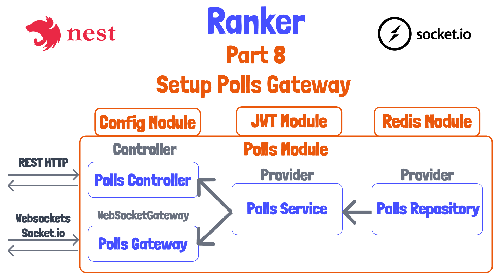

# 08 - Creating a Polls Gateway for Socket.io

*With socket.io homepage open!*

Welcome back!

We've nearly completed the few endpoints required for the REST API of our application. We created these by creating a [polls.controller.ts](../server/src/polls/polls.controller.ts) to handle incoming HTTP requests and outgoing responses. We provided this controller to our [polls.module.ts](../server/src/polls/polls.module.ts), giving our controller access to other features within the module.

Today, we'll create something similar to a controller, but for websockets. Websockets is a way to make real-time, two-way communication between a client and a server. I wanted to do this because I find a lot of very basic websocket tutorials for NestJS, and likewise tutorials for Rest APIs, but rarely do I see them both used.

## Very Basic Intro

We'll use a library that's built on top of websockets called [socket.io](https://socket.io/). This library will allow every participant who connects to our poll to be able to see when another participants join the poll, submit their nominations, and submit their vote.

Looking at the basic example at the socket.io homepage, you can see that a socket.io servers can "emit" or send messages to various clients connected to a server. They can send messages to all clients, or even all client other than themselves. But we'll distinguish between these possibilities later.

Notice that socket.io has libraries to handle both the client, which in our case will be javascript running in a React application, as well as a library for the server. In this case, a client application connects. Upon connect, the server immediately sends a `hello` message with a payload of `world`. This shows that events can be sent and distinguished.

You can also see that a client can send events with data to the server. 

## Creating a Socket.io Gateway

Let's take a look again at the diagram for how we'll add this Gateway along with how it will be used.



To get socket io working in our application, we'll create a class, as is typical of most standard uses of NestJS, though they make clear this isn't required... though they don't really give much in the way of examples of this!

Lets create this class at [polls.gateway.ts](../server/src/polls/polls.gateway.ts).

```ts
import { Logger } from '@nestjs/common';
import { OnGatewayInit, WebSocketGateway } from '@nestjs/websockets';
import { PollsService } from './polls.service';

@WebSocketGateway({
   namespace: 'polls',
})
export class PollsGateway implements OnGatewayInit {
  private readonly logger = new Logger(PollsGateway.name);
  constructor(private readonly pollsService: PollsService) {}

  // Gateway initialized (provided in module and instantiated)
  afterInit(): void {
    this.logger.log(`Websocket Gateway initialized.`);
  }
}

```

Notice that we decorate our class with the `@WebSocketGateway` decorator. This is imported from the `@nestjs/websockets` module. We then add a logger instance to our class, as well as inject the `pollService`. We'll be able to use the [PollsService](../server/src/polls/polls.service.ts) because we'll eventually include this gateway as a part of the [PollsModule](../server/src/polls/polls.module.ts), which has the `PollsService` provided to it. 

The namespace is a way to separate websockets into separate paths or features. We technically don't need this here, but if we wanted some isolated websocket functionality that didn't interact with our poll, we could create it with another `namespace`.

Before continuing on, let's register this Gateway in our polls module so we can see it loaded and registered.

```ts
// ... imports omitted
import { PollsGateway } from './polls.gateway';
//... content omitted

@Module({
  imports: [ConfigModule, redisModule, jwtModule],
  controllers: [PollsController],
  providers: [PollsService, PollsRepository, PollsGateway],
})
export class PollsModule {}
```

*Start up application to see log "Websocket Gateway initialized."*

We don't quite fully have our gateway setup. There are a couple of things we need to handle, one of which we'll complete today.

## Setting up CORS Dynamically

*With [this Stack Overflow post](https://stackoverflow.com/questions/69435506/how-to-pass-a-dynamic-port-to-the-websockets-gateway-in-nestjs) open*.

Recall in our [main.ts file](../server/src/main.ts) that we had to configure CORS options to allow connections to our server from other domains or ports. We set our application to read some environment variables to add this configuration when bootstrapping the application. Unfortunately, the CORS configuration is only available for the Controllers, and we need to add it separately for Gateways.

Most of the instructions for setting this up involve hard coding into the `PollsGateway` as follows.

*Temporarily add this to code*
```ts
@WebSocketGateway({
  namespace: 'polls',
  cors: {
    origin: [
      'http://localhost:8080',
      /^http:\/\/192\.168\.1\.([1-9]|[1-9]\d):8080$/,
    ],
  },
})
```

The problem is that this is a hard-coded configuration, and we need to access environment variables. Unfortunately, there is no way to access the 

I really like [this](https://stackoverflow.com/questions/69435506/how-to-pass-a-dynamic-port-to-the-websockets-gateway-in-nestjs) example on Stack Overflow. See the repository tutorial notes if you need a link. This approach allows us to create our own `IOAdapter` to essentially add configuration to our websockets server! When a websocket gateway gets created, the `IOAdapter`'s `createIOServer` gets called. 

Our adapter will extract environment variables from the `configService` in `main.ts`, and then pass them to our custom adapter. Then we can append options to the `IOAdapter`'s `createIOServer`.

There are some examples out there where you can just directly load the `.env` file directly and then apply the environment variable in the `@WebSocketGateway` decorator, but I feel like that is taking things outside of the NestJS system.

Let's now mimic this, by creating [socket-io-adapter.ts](../server/src/socket-io-adapter.ts).

```ts
import { INestApplicationContext, Logger } from '@nestjs/common';
import { ConfigService } from '@nestjs/config';
import { IoAdapter } from '@nestjs/platform-socket.io';
import { ServerOptions } from 'socket.io';

export class SocketIOAdapter extends IoAdapter {
  private readonly logger = new Logger(SocketIOAdapter.name);
  constructor(
    private app: INestApplicationContext,
    private configService: ConfigService,
  ) {
    super(app);
  }

  createIOServer(port: number, options?: ServerOptions) {
    const clientPort = parseInt(this.configService.get('CLIENT_PORT'));

    const cors = {
      origin: [
        `http://localhost:${clientPort}`,
        new RegExp(`/^http:\/\/192\.168\.1\.([1-9]|[1-9]\d):${clientPort}$/`),
      ],
    };

    this.logger.log('Configuring SocketIO server with custom CORS options', {
      cors,
    });

    const optionsWithCORS: ServerOptions = {
      ...options,
      cors,
    };

    // we need to return this, even though the signature says it returns void
    return super.createIOServer(port, optionsWithCORS);
  }
}
```

Let's now remove our decorator from [polls.gateway.ts](../server/src/polls/polls.gateway.ts).

*Remove `@WebSocketGateway` from `PollsGateway`*

## Apply SocketIOAdapter in main.ts

Let's now tell our application to use the `SocketIOAdapter` that we just created. We do this in [main.ts](../server/src/main.ts) as follows.

```ts
  app.useWebSocketAdapter(new SocketIOAdapter(app, configService));
  await app.listen(port); 
```

## Next Time

That's all for today. I had wanted to handle connections and show how we can work with sockets in Postman, but after that detour to set up a custom adapter, I think it would have been too much. So next time we'll handle and log information about connected clients, and we'll test that out by using Postman. See you then!