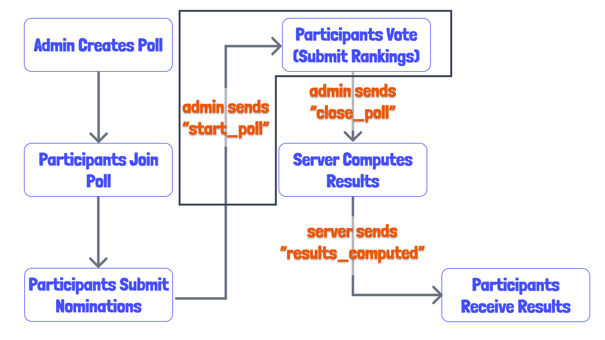

# 15 - Submitting Rankings (Voting)

Last time we added the ability for poll participants to submit nominations.

Today, we'll create a `start_poll` event where the admin can indicate that all of the nominations have been received, and that it is time for each participant to rank these nominations in their preferred order!

We'll also add a `submit_rankings` event for each participant to send in the order in which the submit the rankings. 

## Poll Sequence

I want to review the sequence of events, or how a poll progresses in the following in the quickly created diagram below.



*See video for commentary*

## Adding Poll Types

Let's add the necessary types for these features. We'll first need to update our [shared poll-types](../shared/poll-types.ts), which you'll recall handles keeping the poll types consistent between our server and client. 

In this file, we already have a flag indicating whether voting `hasStarted`. Now we need to add the `rankings`, which we'll do as follows.

```ts
type NominationID = string;

export type Nominations = {
  [nominationID: NominationID]: Nomination;
}

export type Rankings = {
  [userID: string]: NominationID[];
};

export type Poll = {
  id: string;
  topic: string;
  votesPerVoter: number;
  participants: Participants;
  nominations: Nominations;
  rankings: Rankings;
  // results: Results;
  adminID: string;
  hasStarted: boolean;
}
```

Notice that I decided to create a type alias for a `NominationID`. This may seem stupid,but the purpose is to make clear that the rankings map a userID to an array of strings which correspond to `NominationID`s. You may consider doing something similar for other ID strings. 

I also uncomment the `Rankings`. This will cause an error in our [PollsRepository](../server/src/polls/polls.repository.ts) since we are not initializing our poll with an `rankings`. Let's do that now.

```ts
    const initialPoll = {
      id: pollID,
      topic,
      votesPerVoter,
      participants: {},
      nominations: {},
      rankings: {}, // add this
      adminID: userID,
      hasStarted: false,
    };
```

We should now be ready to add the start poll and submit ranking features to our app!

## Adding Start Poll Feature

### [PollsRepository](../server/src/polls/polls.repository.ts)

Let's start by adding the admin-only `start_poll` feature. That means that we'll guard the event handler with our [GatewayAdminGuard](../server/src/polls/gateway-admin.guard.ts) as we've already done a couple times. 

But let's start by adding the repository method in the [PollsRepository](../server/src/polls/polls.repository.ts).

```ts
  async startPoll(pollID: string): Promise<Poll> {
    this.logger.log(`setting hasStarted for poll: ${pollID}`);

    const key = `polls:${pollID}`;

    try {
      await this.redisClient.send_command(
        'JSON.SET',
        key,
        '.hasStarted',
        JSON.stringify(true),
      );

      return this.getPoll(pollID);
    } catch (e) {
      this.logger.error(`Failed set hasStarted for poll: ${pollID}`, e);
      throw new InternalServerErrorException(
        'The was an error starting the poll',
      );
    }
  }
```

### [PollService](../server/src/polls/polls.service.ts)

Let's now add a service method for this, which is fairly straight-forward.

```ts
  async startPoll(pollID: string): Promise<Poll> {
    return this.pollsRepository.startPoll(pollID);
  }
```

I had previously added the admin authorization logic to each service method, but I really like how creating a gateway guard cleaned that up!

### [PollsGateway](../server/src/polls/polls.gateway.ts) - Admin Handler

We'll basically just need to make sure to guard this handler, but this is otherwise pretty straight-forward. 

```ts
  @UseGuards(GatewayAdminGuard)
  @SubscribeMessage('start_vote')
  async startVote(@ConnectedSocket() client: SocketWithAuth): Promise<void> {
    this.logger.debug(`Attempting to start voting for poll: ${client.pollID}`);

    const updatedPoll = await this.pollsService.startPoll(client.pollID);

    this.io.to(client.pollID).emit('poll_updated', updatedPoll);
  }
```

## Submitting Rankings

### [PollsRepository](../server/src/polls/polls.repository.ts)

Let's now work on the feature to submit rankings. This feature will actually be a little more complex on the client than the server. 

First, we'll need to define payload types for our repository method in [types.ts](../server/src/polls/types.ts).

```ts
export type AddParticipantRankingsData = {
  pollID: string;
  userID: string;
  rankings: string[];
};
```

Then we can add the repository method as follows.

```ts
  async addParticipantRankings({
    pollID,
    userID,
    rankings,
  }: AddParticipantRankingsData): Promise<Poll> {
    this.logger.log(
      `Attempting to add rankings for userID/name: ${userID} to pollID: ${pollID}`,
      rankings,
    );

    const key = `polls:${pollID}`;
    const rankingsPath = `.rankings.${userID}`;

    try {
      await this.redisClient.send_command(
        'JSON.SET',
        key,
        rankingsPath,
        JSON.stringify(rankings),
      );

      return this.getPoll(pollID);
    } catch (e) {
      this.logger.error(
        `Failed to add a rankings for userID/name: ${userID}/ to pollID: ${pollID}`,
        rankings,
      );
      throw new InternalServerErrorException(
        'There was an error starting the poll',
      );
    }
  }
```

### [PollService](../server/src/polls/polls.service.ts)

Our service method will actually have a little bit of application logic, because we want to make sure the poll has started to allow the rankings to be submitted. Perhaps this is overkill, as the client application won't do this. But I'm going to do it anyway!

We'll need to add a payload type for our method as we did for the repository in [types.ts](../server/src/polls/types.ts).

```ts
export type SubmitRankingsFields = {
  pollID: string;
  userID: string;
  rankings: string[];
};
```

We could probably just set the `AddParticipantRankingsData` type equal to this, but let's just leave this for now.

```ts
  async submitRankings(rankingsData: SubmitRankingsFields): Promise<Poll> {
    const hasPollStarted = this.pollsRepository.getPoll(rankingsData.pollID);

    if (!hasPollStarted) {
      throw new BadRequestException(
        'Participants cannot rank until the poll has started.',
      );
    }

    return this.pollsRepository.addParticipantRankings(rankingsData);
  }
```

In this example, we're actually going to retrieve our poll to determine if it has started. If it has not, we'll throw a BadRequestException, which should be converted by or exceptions filter into a websocket exception. If the poll has started, then we'll add the rankings for that participant. 

### [PollsGateway](../server/src/polls/polls.gateway.ts)

Now we'll add the gateway handler and event.

```ts
  @SubscribeMessage('submit_rankings')
  async submitRankings(
    @ConnectedSocket() client: SocketWithAuth,
    @MessageBody('rankings') rankings: string[],
  ): Promise<void> {
    this.logger.debug(
      `Submitting votes for user: ${client.userID} belonging to pollID: "${client.pollID}"`,
    );

    const updatedPoll = await this.pollsService.submitRankings({
      pollID: client.pollID,
      userID: client.userID,
      rankings,
    });

    // an enhancement might be to not send ranking data to clients,
    // but merely a list of the participants who have voted since another
    // participant getting this data could lead to cheating
    // we may add this while working on the client
    this.io.to(client.pollID).emit('poll_updated', updatedPoll);
  }
```

*Note the comment, and give explanation*

## Test with Postman

1. Start Poll
2. Join Players 2-4
3. Submit Nominations for each participant
4. Start Poll
5. Submit Rankings for various participants (this may be a little tedious as we need nomination IDs).

## Next Time

Next time we'll add the event to end, or close, the poll. The server will then compute the results and submit them to the participants. 

I'm trying to decide whether or not to go through the ranked choice voting, as it is quite complex. But maybe I'll find some energy to draw up some diagrams and examples. Still, I want the focus to be on building a NestJS application, an not on ranked choice voting, which can be done in many ways.

See you then!