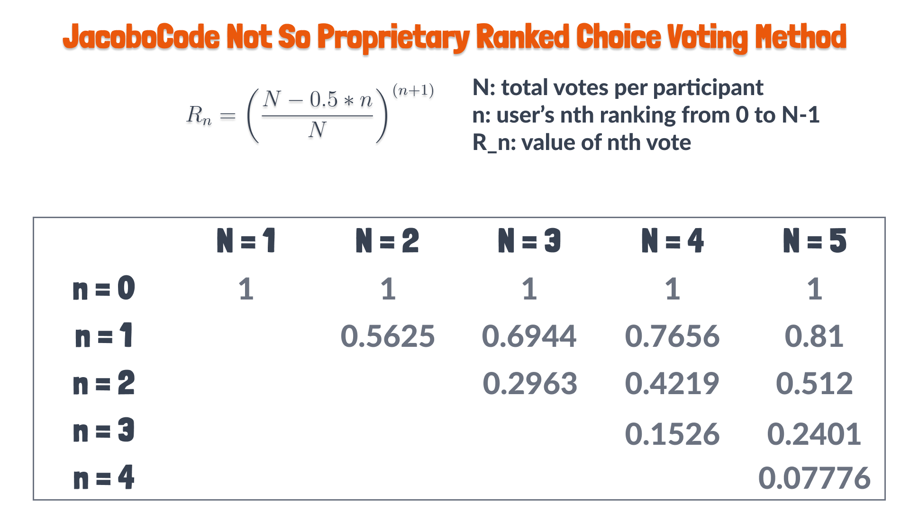

# 16 - Closing Poll and Tallying Votes

Alright, we've added a websocket event handler for each participant to submit their ranked votes. So now it's time to create an event for an admin to close the poll. Once the poll is closed, the server will compute the results, and then send these results back to the clients! We're also going to add a handler for an admin to outright cancel the poll.

*Open [Instant Runoff Example](https://en.wikipedia.org/wiki/Instant-runoff_voting#/media/File:IRV_counting_flowchart.svg)*

I had initially planned on using a particular form of ranked choice voting called "Instant Run Off Voting." If you go back to the introduction to the app, this is what I tried to show. But I was also scratching my head over it. 

In the end, I found that this does not work well for a small group of voters. If I were building an actual election app for a large city, I might use this method.

However, I've decided to simplify things and use a voting method where each participants successive votes get weighted less. We'll sum all of the weighted votes. There will no longer be rounds. 

So basically, I'm saying all of this as a heads up that voting will no longer be done as shown in the demo.

*Review of Github Repo*

## Closing and Cancelling the Poll

### [Poll Types](../shared/poll-types.ts)

When our poll is closed, we'll need to store the final results of the Poll. To do this, let's update our [shared/poll-types](../shared/poll-types.ts) to allow for results. 

```ts
export type Results = Array<{
  nominationID: NominationID,
  nominationText: string,
  score: number,
}>;

export type Poll = {
  id: string;
  topic: string;
  votesPerVoter: number;
  participants: Participants;
  nominations: Nominations;
  rankings: Rankings;
  results: Results;
  adminID: string;
  hasStarted: boolean;
}
```

We could also store some sort of `boolean` field in the poll to indicate that it is closed. But for me, we'll just say voting is over if the results has some length. Another option could be to make `results` nullable.

One thing before continuing is to now update our `initialPoll` in the [PollsRepository](../server/src/polls/polls.repository.ts).

```ts
    const initialPoll = {
      id: pollID,
      topic,
      votesPerVoter,
      participants: {},
      nominations: {},
      rankings: {},
      results: [],
      adminID: userID,
      hasStarted: false,
    };
```

### [PollsRepository](../server/src/polls/polls.repository.ts)

Let's now add a method to store these results in the database. We'll also add a method to cancel the poll. 

```ts
  async addResults(pollID: string, results: Results): Promise<Poll> {
    this.logger.log(
      `Attempting to add results to pollID: ${pollID}`,
      JSON.stringify(results),
    );

    const key = `polls:${pollID}`;
    const resultsPath = `.results`;

    try {
      await this.redisClient.send_command(
        'JSON.SET',
        key,
        resultsPath,
        JSON.stringify(results),
      );

      return this.getPoll(pollID);
    } catch (e) {
      this.logger.error(
        `Failed to add add results for pollID: ${pollID}`,
        results,
        e,
      );
      throw new InternalServerErrorException(
        `Failed to add add results for pollID: ${pollID}`,
      );
    }
  }

  async deletePoll(pollID: string): Promise<void> {
    const key = `polls:${pollID}`;

    this.logger.log(`deleting poll: ${pollID}`);

    try {
      await this.redisClient.send_command('JSON.DEL', key);
    } catch (e) {
      this.logger.error(`Failed to delete poll: ${pollID}`, e);
      throw new InternalServerErrorException(
        `Failed to delete poll: ${pollID}`,
      );
    }
  }
```

These are pretty straightforward, I hope. The actual results will be computed in the service layer. 

One difference from many of the other methods is that when we delete a poll, it basically ceases to exist. We'll handle how we let all connect clients know this shortly. 

### [PollsService](../server/src/polls/polls.service.ts)

Let's now work on methods for these 2 features in the `PollService`. This is where we'll compute results. For now, we'll just create the function for computing the results which returns an empty array. We'll come back to explain the logic later. 

```ts
  async computeResults(pollID: string): Promise<Poll> {
    const poll = await this.pollsRepository.getPoll(pollID);

    const results = getResults(poll.rankings, poll.nominations);

    return this.pollsRepository.addResults(pollID, results);
  }

  async cancelPoll(pollID: string): Promise<void> {
    await this.pollsRepository.deletePoll(pollID);
  }
```

For now, let's create a [getResults.ts](../server/src/polls/getResults.ts) file to hold our computation function. 

```ts
import { Nominations, Rankings, Results } from 'shared';

export default (
  rankings: Rankings,
  nominations: Nominations,
  votesPerVoter: number,
): Results => {
  return [];
};
```

And make sure to import this into the `PollsService`.

### [PollsGateway](../server/src/polls/polls.gateway.ts)

We'll now add a couple of Gateway methods to "close" and "cancel" polls.

Both of these events will need to be guarded with the [GatewayAdminGuard](../server/src/polls/gateway-admin.guard.ts).

```ts
  @UseGuards(GatewayAdminGuard)
  @SubscribeMessage('close_poll')
  async closePoll(@ConnectedSocket() client: SocketWithAuth): Promise<void> {
    this.logger.debug(`Closing poll: ${client.pollID} and computing results`);

    const updatedPoll = await this.pollsService.computeResults(client.pollID);

    this.io.to(client.pollID).emit('poll_updated', updatedPoll);
  } 
```

```ts
  @UseGuards(GatewayAdminGuard)
  @SubscribeMessage('cancel_poll')
  async cancelPoll(@ConnectedSocket() client: SocketWithAuth): Promise<void> {
    this.logger.debug(`Cancelling poll with id: "${client.pollID}"`);

    await this.pollsService.cancelPoll(client.pollID);

    this.io.to(client.pollID).emit('poll_cancelled');
  }
```

These are pretty straightforward. One difference is we're actually using a different event when canceling the poll, because if we cancel a poll, it no longer exists. So we simply send a different event without any payload. 

### [getResults](../server/src/polls/getResults.ts)

Let's now go over how we'll compute results. I decided that doing rounds of votes and eliminating the last place candidate 

So I created a sort of weighted formula for each vote depending on the total number of `votesPerVoter` as shown in the following images.




Let's now implement this logic in our `getResults` function.

```ts
import { Nominations, Rankings, Results } from 'shared';

export default (
  rankings: Rankings,
  nominations: Nominations,
  votesPerVoter: number,
): Results => {
  // 1. Each value of `rankings` key values is an array of a participants'
  // vote. Points for each array element corresponds to following formula:
  // r_n = ((votesPerVoter - 0.5*n) / votesPerVoter)^(n+1), where n corresponds
  // to array index of rankings.
  // Accumulate score per nominationID
  const scores: { [nominationID: string]: number } = {};

  Object.values(rankings).forEach((userRankings) => {
    userRankings.forEach((nominationID, n) => {
      const voteValue = Math.pow(
        (votesPerVoter - 0.5 * n) / votesPerVoter,
        n + 1,
      );

      scores[nominationID] = (scores[nominationID] ?? 0) + voteValue;
    });
  });

  // 2. Take nominationID to score mapping, and merge in nominationText
  // and nominationID into value
  const results = Object.entries(scores).map(([nominationID, score]) => ({
    nominationID,
    nominationText: nominations[nominationID].text,
    score,
  }));

  // 3. Sort values by score in descending order
  results.sort((res1, res2) => res2.score - res1.score);

  return results;
};
```

#### Example Unit Test

*Show example unit test of this function*. It can be found in the repository. Must change into `server` folder to run `npm run test`.

## Postman Demo

1. Create a Poll with Nominations ahead of time
2. Show the poll with the nominations inside of redisClient
3. Send `close_poll` event with non-admin to show auth error
4. Send `close_poll` with admin and results sent to clients as well as stored on server.
5. Create another poll with admin. Then submit `cancel_poll`.

## Conclusion

That's all for our NestJS work. This is a really long tutorial, and I really don't know if it has much of an audience, because if you've stuck with this, you can probably figure this out on your own! But, I'm not in it for an audience, I'm in it to learn things myself. 

Anyhow, next time we'll get working on our React client application. 